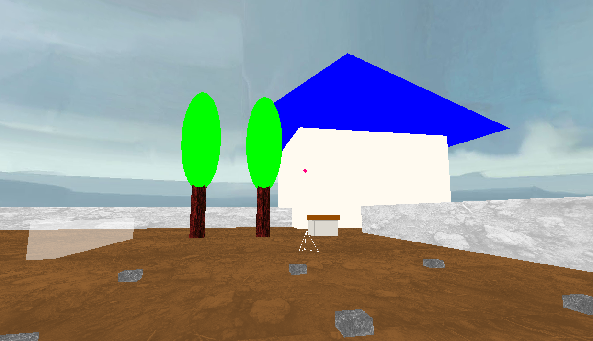

# 3DGame Starter Kit for Ursina by Eric Marchand



## Introduction
`3dgame` is a starter kit designed for developing 3D games using the Ursina engine. This project aims to provide a solid foundation for quick 3D game development in Python by integrating necessary libraries and setting up the initial development environment.

## Prerequisites
This project requires Python 3.6 or newer. Ensure that Python is properly installed on your system before proceeding.

## Dependencies
The `3dgame` starter kit relies on the following libraries:
- `Ursina`: A powerful game engine for Python, ideal for rapid game development.
- `numpy`: Used for complex mathematical calculations needed in game development.
- `psd-tools3==1.8.2`: Required for advanced manipulation of PSD files in game development.

## Installation

### Clone the Repository
Start by cloning the repository to your local machine using Git:
```
git clone https://github.com/stakepoolplace/3dgame.git
cd 3dgame
```

### Set Up a Virtual Environment
It is recommended to use a virtual environment to manage the project's dependencies:
```
python -m venv venv
venv\\Scripts\\activate  # On Windows
source venv/bin/activate  # On Unix or MacOS
```

### Install Dependencies
Next, install all required dependencies using `pip`:
```
pip install -r requirements.txt
```

## Quick Start
To start the game, run the main project script:
```
python main.py
```

## Contributing
Contributions to this project are welcome! If you have improvements or fixes, feel free to fork the repository, make your changes, and submit a pull request.

## License
`3dgame` is distributed under the MIT License. See the `LICENSE` file for more details.
